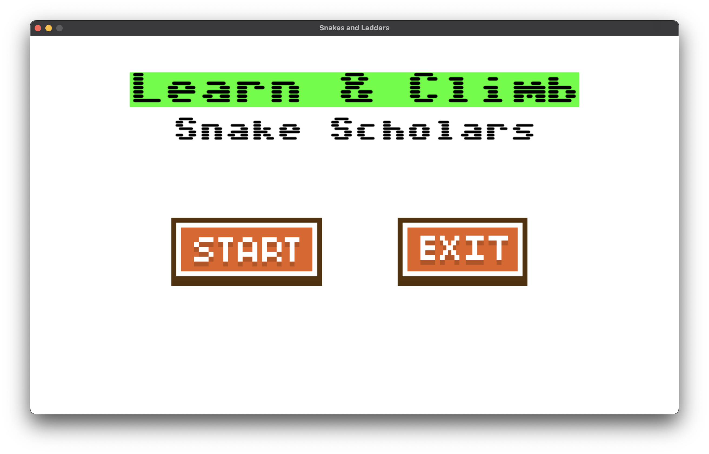
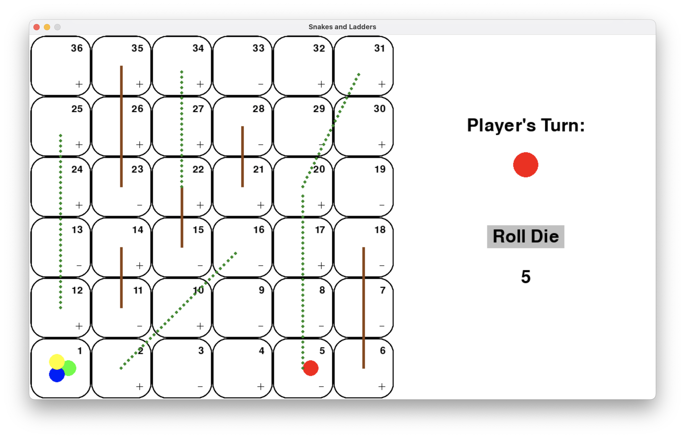

# McHacks 11 Hackathon: 'Learn & Climb: Snake Scholars'

## Team Members

- [Giannino Lombardi](https://github.com/ninolombardi)
- [Zuhayr Mahmood](https://github.com/zuhayrmahmood)
- [Kevin Wang](https://github.com/devkevw)

## Description

The inspiration behind creating 'Learn & Climb: Snake Scholars' stemmed from witnessing/experiencing the struggle children often face in maintaining interest and focus during educational activities, particularly in subjects like math. The project functions similarly to a typical snakes and ladders game. The only caveat is that every time a player rolls the dice, they are faced with a mathematical problem to solve. If they answer correctly, they successfully move to the tile. If not, they stay where they are. Prior to starting the game, the user can decide the amount of players and the level of difficulty. Level 1 focuses on addition/subtraction, level 2 introduces multiplication and level 3 has division problems as well. Players are incentivized to correctly answer these questions in order to reach the final tile (and thus, win the game) as fast as possible. 

## Technologies Used

We used pygame library for our user interface whereas our functional back-end game was created solely using python.

## Problems Encountered

We ran into issues with the user interface portion of the project. Lack of prior knowledge of pygame library as well as time management issues meant we were unable to complete a fully functional project prior to the deadline. Too much time was spent becoming familiar with pygame library and as a result, we were left with an insufficient amount of time to code. It was the first time the three of us collaborated on a coding project together and perhaps a lack of previous experience was detrimental to our cause. 

## Demo

Check out our [Devpost](https://devpost.com/software/educational-snakes-and-ladders?ref_content=user-portfolio&ref_feature=in_progress)!

